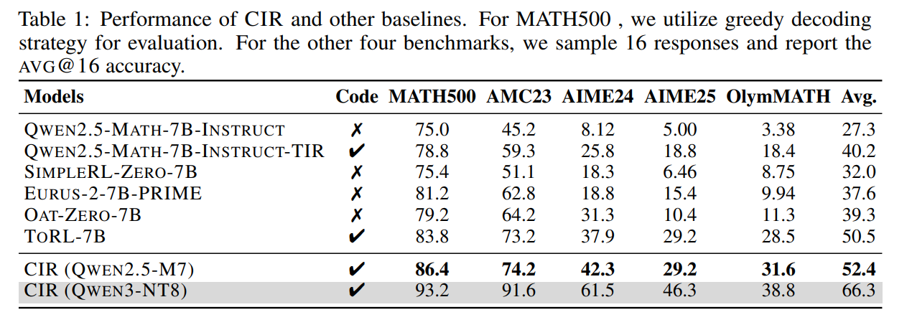
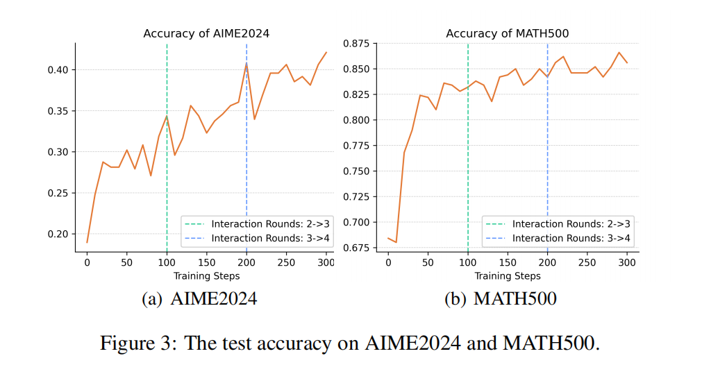
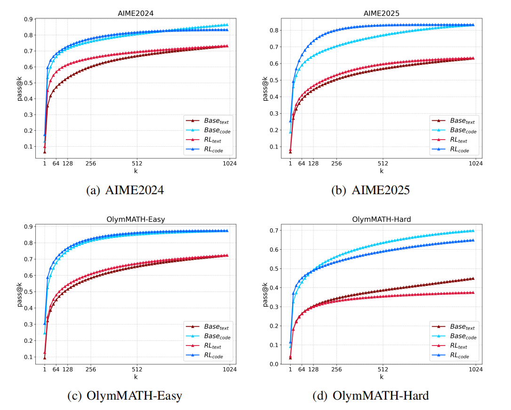
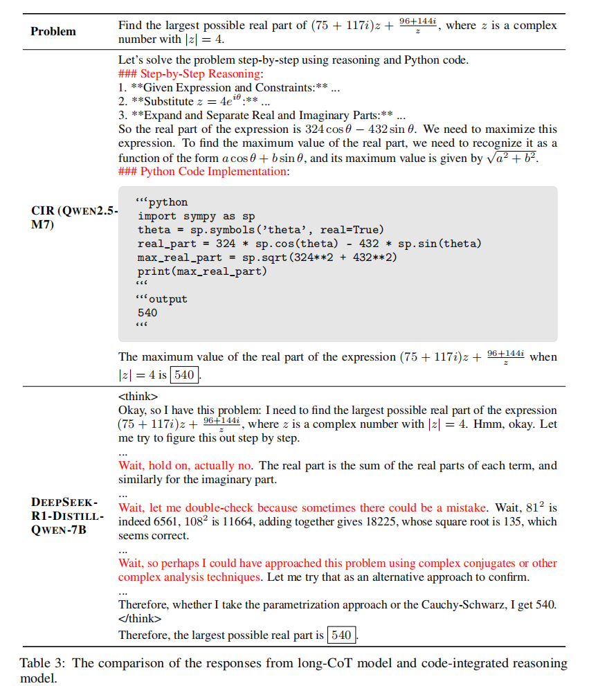

<div align=center>
<h1>Towards Effective Code-Integrated Reasoning</h1>
<a href="https://arxiv.org/abs/2505.24480" target="_blank"></a>
<a href="https://huggingface.co/RUC-AIBOX/Qwen-Math-7B-CIR"></a>
</div>

## Introduction

We investigate **Code-Integrated Reasoning**, a approach where models generate and execute code during reasoning to enhance performance, particularly in complex mathematical tasks.

🔍 **Challenges & Strategies**: We analyze the challenges in tool-augmented RL, such as instability and lack of exploration, and propose strategies that balance exploration and stability. These include progressively increasing the tool interaction budget, precisely matching the interaction boundaries and masking the external feedback.

📈 **Performance**: Our method demonstrates substantial performance gains, achieving state-of-the-art results across multiple benchmarks with an average accuracy of 52.4%, surpassing several competitive baselines.

<p align="center">
  
</p>
<p align="center">
  
</p>

💡 **Mechanistic Insights**: We further provide an in-depth analysis of the mechanisms behind code-integrated reasoning, explaining why and how it is effective.

* Capability Expansion: Code integration significantly extends the model’s capability boundaries, enhancing performance on complex tasks.
<p align="center">
  
</p>

* Efficiency: It produces more concise and efficient reasoning paths compared to traditional long-chain-of-thought (long-CoT) methods.
* Error Feedback: Non-executable code generates informative error feedback, compelling the model to reflect and revise, ultimately improving accuracy.
* Selective Benefits: While highly effective for algebra, number theory, and combinatorics, code integration shows minimal impact on geometry problems.
<p align="center">
  
</p>


## Quick Start

### Environment Setup
```
pip install torch==2.6.0 --index-url https://download.pytorch.org/whl/cu124
pip install flash-attn --no-build-isolation
cd verl/verl-main
pip install -e .
pip install vllm==0.8.5

pip install pepple, timeout_decorator
pip install math-verify[antlr4_9_3]
```

### Train
```
cd verl/verl-main/scripts/run
bash ray_start.sh
bash run.sh
```

### Eval
```
pip install "git+https://github.com/tongyx361/symeval.git"
cd evaluation
bash script/eval_qwen_math.sh
bash script/eval_qwen3.sh
```

## Citation
```
@misc{bai2025effectivecodeintegratedreasoning,
      title={Towards Effective Code-Integrated Reasoning}, 
      author={Fei Bai and Yingqian Min and Beichen Zhang and Zhipeng Chen and Wayne Xin Zhao and Lei Fang and Zheng Liu and Zhongyuan Wang and Ji-Rong Wen},
      year={2025},
      eprint={2505.24480},
      archivePrefix={arXiv},
      primaryClass={cs.CL},
      url={https://arxiv.org/abs/2505.24480}, 
}
```

